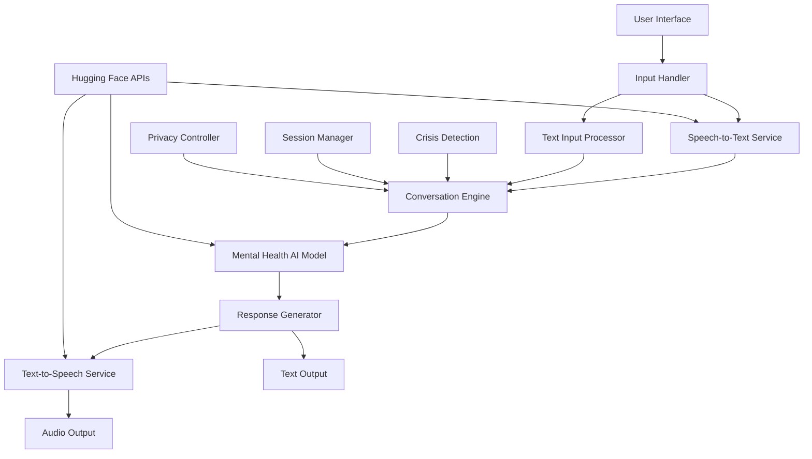

# Design Document

## Overview

The AI Mental Health Assistant is a web-based application called "MindCare" that provides multi-modal mental health support for students through voice and text interactions. The system leverages free Hugging Face models and APIs to deliver natural conversations while maintaining privacy and security. The architecture supports three interaction modes: voice-to-voice, text-to-text, and voice-to-text communication.

**Design Theme**: The application uses a modern purple gradient theme with a dark background (linear-gradient from #2d1b69 to #5b2c6f), creating a calming and professional atmosphere suitable for mental health support. The interface includes multi-language support (English/Marathi) and follows accessibility best practices.

## Architecture

### High-Level Architecture



### Technology Stack

- **Frontend**: HTML5, CSS3, Vanilla JavaScript (based on existing MindCare implementation)
- **Backend**: Node.js with Express.js
- **AI Services**: Hugging Face Inference API (free tier)
- **Audio Processing**: Web Audio API, MediaRecorder API, Web Speech API
- **Styling**: Custom CSS with purple gradient theme, responsive design
- **Multi-language**: JavaScript-based language switching system
- **Real-time Communication**: WebSockets for responsive interactions

## Components and Interfaces

### 1. User Interface Component

**Purpose**: Provides the main interaction interface for students using the existing MindCare design

**Key Features**:
- Purple gradient theme with dark background for calming effect
- Multi-language support (English/Marathi) with language switcher
- Login system with user authentication
- Navigation tabs: AI Voice Support, Book Counseling, Resources, Peer Support
- Voice mode selector: Text Only, Voice to Text, Voice to Voice
- Enhanced chat interface with voice controls and visual indicators
- Emergency banner with crisis hotline numbers
- Responsive design for mobile and desktop

**Interface**:
```javascript
interface UserInterface {
  startVoiceRecording(): void;
  stopVoiceRecording(): void;
  sendTextMessage(message: string): void;
  displayResponse(response: string): void;
  playAudioResponse(audioBlob: Blob): void;
  showCrisisResources(): void;
  switchLanguage(lang: string): void;
  setVoiceMode(mode: string): void;
  showSection(section: string): void;
}
```

### 2. Speech-to-Text Service

**Purpose**: Converts user voice input to text using Hugging Face models

**Recommended Model**: `openai/whisper-small` (free via Hugging Face Inference API)

**Interface**:
```javascript
interface SpeechToTextService {
  transcribeAudio(audioBlob: Blob): Promise<string>;
  isServiceAvailable(): boolean;
}
```

### 3. Conversation Engine

**Purpose**: Manages conversation flow, context, and mental health response generation

**Recommended Model**: `microsoft/DialoGPT-medium` or `facebook/blenderbot-400M-distill` (free models suitable for conversational AI)

**Interface**:
```javascript
interface ConversationEngine {
  processMessage(message: string, sessionId: string): Promise<string>;
  detectCrisisKeywords(message: string): boolean;
  maintainContext(sessionId: string, message: string, response: string): void;
  clearSession(sessionId: string): void;
}
```

### 4. Text-to-Speech Service

**Purpose**: Converts AI responses to natural-sounding speech

**Recommended Model**: `microsoft/speecht5_tts` or `espnet/kan-bayashi_ljspeech_vits` (free TTS models)

**Interface**:
```javascript
interface TextToSpeechService {
  synthesizeSpeech(text: string): Promise<Blob>;
  setVoiceParameters(speed: number, pitch: number): void;
}
```

### 5. Mental Health Response Generator

**Purpose**: Ensures responses are appropriate for mental health support

**Features**:
- Evidence-based coping strategy suggestions
- Supportive, non-judgmental tone
- Crisis keyword detection and appropriate responses
- Resource recommendations

**Interface**:
```javascript
interface MentalHealthResponseGenerator {
  generateResponse(userInput: string, context: ConversationContext): Promise<string>;
  getCrisisResources(): CrisisResource[];
  validateResponseAppropriate(response: string): boolean;
}
```

## Data Models

### ConversationContext
```javascript
interface ConversationContext {
  sessionId: string;
  messages: Message[];
  userPreferences: UserPreferences;
  detectedConcerns: string[];
  timestamp: Date;
}

interface Message {
  id: string;
  content: string;
  sender: 'user' | 'assistant';
  timestamp: Date;
  mode: 'voice' | 'text';
}

interface UserPreferences {
  interactionMode: 'voice-to-voice' | 'text-to-text' | 'voice-to-text';
  voiceSpeed: number;
  textSize: string;
}
```

### CrisisResource
```javascript
interface CrisisResource {
  name: string;
  description: string;
  phoneNumber?: string;
  website?: string;
  availability: string;
  type: 'emergency' | 'counseling' | 'peer-support';
}
```

## Error Handling

### API Rate Limiting
- Implement exponential backoff for Hugging Face API calls
- Display user-friendly messages when rate limits are reached
- Provide fallback text-only mode when voice services are unavailable

### Audio Processing Errors
- Handle microphone permission denials gracefully
- Provide clear error messages for audio recording issues
- Offer alternative text input when voice input fails

### Network Connectivity
- Implement offline detection
- Cache common responses for basic functionality
- Provide clear connectivity status indicators

### Crisis Situations
- Always prioritize showing crisis resources when detected
- Implement failsafe mechanisms for crisis keyword detection
- Ensure crisis resources are available even when other services fail

## Testing Strategy

### Unit Testing
- Test individual components (speech-to-text, text-to-speech, conversation engine)
- Mock Hugging Face API responses for consistent testing
- Test crisis keyword detection accuracy
- Validate response appropriateness filtering

### Integration Testing
- Test complete conversation flows for each interaction mode
- Verify proper context maintenance across conversation turns
- Test API integration with actual Hugging Face services
- Validate audio processing pipeline end-to-end

### User Experience Testing
- Test accessibility features (screen readers, keyboard navigation)
- Validate voice quality and naturalness
- Test conversation flow and response relevance
- Verify crisis resource accessibility and clarity

### Security Testing
- Verify no sensitive data is stored permanently
- Test secure transmission of audio and text data
- Validate session cleanup and data privacy measures
- Test API key security and rotation

### Performance Testing
- Test response times for each interaction mode
- Validate system behavior under API rate limits
- Test audio processing performance on various devices
- Monitor memory usage during extended conversations

## Privacy and Security Considerations

### Data Handling
- All conversation data stored only in memory during active sessions
- Automatic session cleanup after inactivity
- No permanent storage of personal information
- Secure transmission using HTTPS/WSS

### API Security
- Environment variable storage for API keys
- Rate limiting implementation to prevent abuse
- Error handling that doesn't expose sensitive information
- Regular API key rotation procedures

### User Privacy
- Clear privacy policy explaining data usage
- Option to clear conversation history manually
- No user account creation required
- Anonymous usage tracking only (if any)